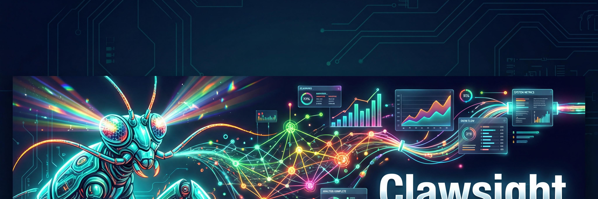

<p align="center">
  
</p>

<p align="center">
  <strong>Cross-source career intelligence for the AI era — know yourself, find your position, take action.</strong>
</p>

<p align="center">
  <a href="LICENSE"></a>
  
  
  
</p>

---

Your resume says "Java lead" but your GitHub is 90% Go. Three LinkedIn recommenders highlight your mentoring, yet your resume never mentions leadership. You sit at the intersection of payment systems × distributed architecture × global ops — a combination held by fewer than 2% of senior engineers. And in an AI revolution reshaping every career, you have no idea whether your next move should be doubling down or pivoting.

**These insights are invisible from any single source. They only emerge when you look across data streams — and map them against the forces reshaping your industry.**

Clawsight does exactly that. Named after the **Mantis Shrimp** 🦐 — the creature with 16 types of color receptors that sees dimensions invisible to all other species.

## Quick Start

```bash
# 1. Install
/install clawsight

# 2. Import your data (the more sources, the sharper the insight)
/clawsight resume.pdf
/clawsight https://github.com/yourusername
/clawsight linkedin.zip

# 3. Run the Career Intelligence Chain
/career-mirror       # Who am I really? (introspection)
/tech-spectrum       # Where do I stand in the AI revolution? (positioning)
/career-sim          # What paths are open to me? (simulation)
/tech-compass        # What do I do next? (action plan)
```

No data? Every skill works in **Lite Mode** too — just with interactive Q&A instead of cross-source depth.

## The Career Intelligence Chain

This is Clawsight's core value proposition: a four-skill pipeline that takes you from self-knowledge to concrete action.

```
  🪞 career-mirror       🌈 tech-spectrum       🔮 career-sim         🧭 tech-compass
  ─────────────────  →  ─────────────────  →  ─────────────────  →  ─────────────────
  "Who am I really?"    "Where do I stand    "What paths are       "What do I do
                         in the AI era?"      open to me?"          next?"

  ▸ Career Arc          ▸ Five-Level Spectrum  ▸ 3-5 Divergent Paths  ▸ Skill Quadrant Matrix
  ▸ Advantage Verify    ▸ AI Exposure Analysis ▸ Comparison Matrix    ▸ AI Skill Layer (L0→L4)
  ▸ Behavioral Truth    ▸ Trend × Profile      ▸ Trade-off Analysis   ▸ Learning Routes
  ▸ Blind Spot Map      ▸ Opportunity Windows  ▸ Decision Framework   ▸ 30-60-90 Day Plan
```

Each skill automatically passes structured data downstream, so the chain builds on itself:

| Skill | Command | Input | Output |
|-------|---------|-------|--------|
| **[career-mirror](skills/career-mirror/)** | `/career-mirror` | Clawsight profile | Verified advantages, behavioral patterns, blind spots |
| **[tech-spectrum](skills/tech-spectrum/)** | `/tech-spectrum` | Profile + career-mirror | AI spectrum position, exposure analysis, opportunity windows |
| **[career-sim](skills/career-sim/)** | `/career-sim` | Profile + both upstreams | 3-5 divergent career paths, comparison matrix, trade-offs |
| **[tech-compass](skills/tech-compass/)** | `/tech-compass` | Profile + all upstreams | Skill quadrant, AI skill layer, action plan for chosen path |

### Three Operating Modes

Every Scene Skill adapts to what's available:

| Mode | When | Experience |
|------|------|------------|
| **Enhanced** | Profile + upstream skill outputs | Full chain with cross-validated intelligence |
| **Rich** | Clawsight profile only | Profile-driven analysis, no upstream data |
| **Lite** | Nothing imported | Interactive Q&A — still useful, just less precise |

## What Clawsight Sees That You Can't

### Cross-Source Reconciliation

The engine behind everything. When you import 2+ sources, Clawsight doesn't just merge — it **cross-references**:

```
Resume says: "Java Lead, 8 years"
GitHub shows: 47 repos, 92% Go, 3 CNCF contributions
LinkedIn recs: "exceptional mentoring", "natural leader"

Clawsight sees:
  → Behavioral-Declarative Gap: identity shifted to Go, resume tells Java story
  → Hidden Strength: leadership evidenced by others but never self-claimed
  → Compound Advantage: payments × distributed × global = rare triple stack
```

Five conflict types detected (factual, temporal, emphasis, omission, granularity). Four auto-resolved. Factual contradictions escalated to user. Contradictions become insights, not errors.

### Trust Hierarchy

Not all data is equal:

| Source Type | Trust Weight | Example |
|-------------|:---:|---------|
| Behavioral | 0.9 | GitHub commits, contribution patterns |
| Third-party | 0.8 | LinkedIn recommendations, endorsements |
| Declarative | 0.7 | Resume claims, self-descriptions |
| Inferred | 0.5 | Cross-reference deductions |

## Supported Sources

| Source | Command | What It Captures |
|--------|---------|-----------------|
| Resume (PDF/text) | `/clawsight resume.pdf` | Career narrative, declared skills, achievements |
| GitHub | `/clawsight https://github.com/user` | Real tech stack, contribution patterns, coding rhythm |
| LinkedIn export | `/clawsight linkedin.zip` | Recommendations, endorsements, network signals |
| Personal website | `/clawsight https://yoursite.com` | Self-presentation, projects, writing style |
| JSON Resume | `/clawsight resume.json` | Structured profile data |

> **LinkedIn**: Export via **Settings → Get a copy of your data**. See [LinkedIn Guide](docs/linkedin-guide.md) for steps.

### More Commands

| Command | Description |
|---------|-------------|
| `/clawsight insight` | Hidden strengths, blind spots, behavioral-declarative gaps |
| `/clawsight potential` | Compound advantages × industry trends mapping |
| `/clawsight score` | Profile completeness and understanding level |
| `/clawsight refresh` | Re-fetch all sources, track profile evolution over time |

## Architecture

```
  Sources                    Memory                   Scene Skills
  ───────┈                    ──────                   ────────────
  Resume ─┐                 USER.md                  🪞 career-mirror
  GitHub ─┤   Parse →        MEMORY.md          →     🌈 tech-spectrum
  LinkedIn┤   Reconcile →    memory/projects/*         🔮 career-sim
  Website ┘   Write →                                  🧭 tech-compass
                                                       📝 writing-voice *
              ⛔ Privacy Preview                       📚 learning-path *
              before any write                         👤 stakeholder-briefer *

                                                       * Planned
```

**Pure Skill architecture**: No runtime. No dependencies. No compiled code. Just `SKILL.md` files interpreted by your AI agent. Works with any OpenClaw-compatible environment (Claude Code, etc.).

### Key Design Decisions

- **Read-only Scene Skills**: Scene Skills consume profile data but never write to it. Data integrity preserved.
- **Cross-skill data passing**: HTML comment blocks with structured YAML, appended to reports. Downstream skills parse them silently.
- **Graceful degradation**: Every skill works without a profile. More data = sharper insight, but zero data ≠ zero value.
- **< 6KB per Scene Skill**: Each SKILL.md is self-contained and stays under the size budget. Methodology and reference data live in `docs/`.

See [docs/architecture.md](docs/architecture.md) for the full technical deep dive.

## AI Trends Data Layer

Clawsight ships with a structured AI development timeline — the data backbone for tech-spectrum's positioning analysis:

- **130+ milestones** across **8 tracks**: Agent & Toolchain, AI-Native Dev, Vertical AI, Multimodal, Safety & Governance, Infrastructure, Data Engineering, Hardware/Edge
- Each track with: development phases, key milestones, acceleration rating, career impact assessment
- Cross-track fusion analysis with scarcity ratings for intersection opportunities
- Updated quarterly; designed for community contribution

See [docs/ai-trends.md](docs/ai-trends.md) for the full timeline.

## MCP Enhancement Path

Clawsight is designed to evolve from pure prompt intelligence to tool-augmented intelligence:

| Phase | What | Status |
|-------|------|--------|
| **Phase 1: Pure Skill** | LLM general knowledge + user profile | ✅ Current |
| **Phase 2: MCP Tools** | Web search for real-time trends, job market APIs for demand validation | 🔜 Next |
| **Phase 3: Data Layer** | Structured databases, skill taxonomies, market indices | 📋 Planned |

Every data claim in output is tagged `[data-based]`, `[general-knowledge]`, or `[real-time]` so users always know the source.

## Documentation

| Doc | Content |
|-----|---------|
| [Architecture](docs/architecture.md) | System design, pipeline detail, data flow |
| [Scene Skills Protocol](docs/scene-skills-protocol.md) | How Scene Skills interact, data passing format, mode detection |
| [AI Trends](docs/ai-trends.md) | 8-track AI development timeline (130+ milestones) |
| [Skill Layers](docs/skill-layers.md) | AI Skill Layers L0→L4 framework with assessment criteria |
| [Schema](docs/schema.md) | Canonical data extraction schema |
| [Scoring](docs/scoring.md) | Profile completeness scoring methodology |
| [Templates](docs/templates.md) | Output templates for reports and memory files |
| [User Journey](docs/user-journey.md) | Interaction lifecycle and onboarding flow |
| [LinkedIn Guide](docs/linkedin-guide.md) | Step-by-step LinkedIn data export |
| [Changelog](docs/changelog.md) | Version history |

## Roadmap

- [x] **v0.3** — Multi-source engine + Pure Skill rewrite
- [x] **v0.4** — Insight deepening + LinkedIn recommendations + refresh
- [x] **v0.5** — Potential discovery + dialogue enrichment + career-mirror v1
- [x] **v0.6** — Career Intelligence Chain (career-mirror v2 + tech-spectrum + tech-compass)
- [x] **v0.7** — career-sim + 4-skill chain (mirror → spectrum → sim → compass)
- [ ] **v0.8** — MCP Phase 2: real-time trend data + job market validation
- [ ] **v0.9** — writing-voice + learning-path Scene Skills
- [ ] **v1.0** — OpenClaw profile standard + community skill marketplace

## Contributing

Clawsight is an open-source project. Here's how you can contribute:

**Build a Scene Skill** — The highest-impact contribution. Create a new skill under `skills/` that consumes Clawsight profile data. Reference: [career-mirror](skills/career-mirror/), protocol: [scene-skills-protocol.md](docs/scene-skills-protocol.md).

**Maintain AI Trends** — Help keep [docs/ai-trends.md](docs/ai-trends.md) current with new milestones, updated phase assessments, and career impact analysis.

**Add a Source Parser** — Propose new sources (Stack Overflow, Dribbble, Behance, etc.) by opening an issue.

**Sharpen Reconciliation** — The cross-source heuristics in SKILL.md improve with real-world edge cases. If you find a conflict type it handles poorly, report it.

**Fix Bugs & Docs** — Typos, unclear instructions, missing edge cases — all PRs welcome.

```bash
git checkout -b feature/your-contribution
# Make changes, then open a PR
```

## License

[MIT](LICENSE) — use it, modify it, ship it.
